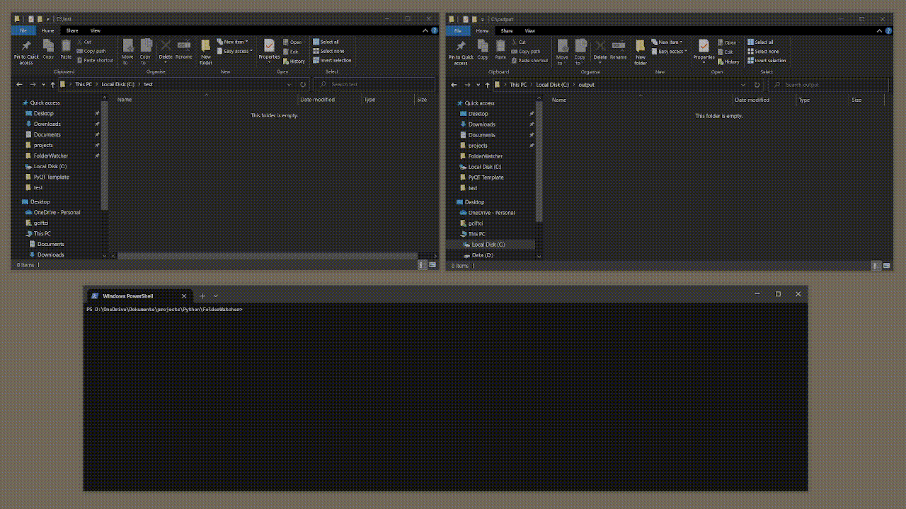

<div align="center"><h1> Welcome to the amazing FolderWatcher!</h1></div>

<div align="center">
  
[](https://https://ch.linkedin.com/in/garbis-ciftci/)[](https://www.instagram.com/garbis.ci/)[](mailto:garbis.ciftci@gmail.com)


</div>


## Content
- [Welcome to the amazing FolderWatcher!](#welcome-to-the-amazing-folderwatcher)
  - [Content](#content)
  - [What is FolderWatcher?](#what-is-folderwatcher)
  - [How does it work?](#how-does-it-work)
  - [How to use FolderWatcher](#how-to-use-folderwatcher)
    - [1. Clone this repository onto your local machine.](#1-clone-this-repository-onto-your-local-machine)
    - [3. Create a virtual environment and activate it.](#3-create-a-virtual-environment-and-activate-it)
    - [4. Install the required packages](#4-install-the-required-packages)
    - [5. Customize the constants in main.py to match your desired configuration.](#5-customize-the-constants-in-mainpy-to-match-your-desired-configuration)
    - [6. Run to start monitoring the folder for new files.](#6-run-to-start-monitoring-the-folder-for-new-files)
  - [Adding new processes](#adding-new-processes)
  - [Examples](#examples)
  - [Contribution](#contribution)
  - [License](#license)
  - [Contact](#contact)

## What is FolderWatcher?
FolderWatcher is a Python-based application that monitors a folder for new files and processes them using a list of processes. The goal of FolderWatcher is to automate your workflow and save you time by performing various file operations automatically.

## How does it work?
FolderWatcher monitors a folder for new files and processes them using a list of processes. You can customize the list of processes to fit your needs by creating new processes **(plugins)** and adding them to the list. The program includes a few basic processes that can be customized to suit your needs.

## How to use FolderWatcher
### 1. Clone this repository onto your local machine.
```bash
$ git clone https://github.com/gciftci/FolderWatcher
```
### 3. Create a virtual environment and activate it.
```bash
$ python -m venv .venv
```
### 4. Install the required packages
```bash
$ pip install -r requirements.txt
```

### 5. Customize the constants in main.py to match your desired configuration.

### 6. Run to start monitoring the folder for new files.
```bash
$ python main.py
```

## Adding new processes
You can add new processes to FolderWatcher by creating a new Python file in the `app/processes/custom` directory. The new file should define a new process class that inherits from the `Process` base class in `app/utils/folderwatcher.py`. Here is a sample process class definition:

```python
from app.utils.folderwatcher import Process


class MyProcess(Process):
    """
    Process for performing some operation on a file.
    """
    def execute(self, filepath: str) -> None:
        """
        Perform some operation on a file.

        Args:
            filepath (str): The path of the file to process.
        """
        # TODO: Implement some operation on the file.
```

Once you have defined your new process class, you can add it to the list of processes in `main.py`:

```python
process_manager.add_process(MyProcess())
```
## Examples
Here are some examples of what FolderWatcher can do:

* Rename a file using the current date and time.
* Move a file to a subfolder called "processed".
* Perform OCR on a file. (not yet implemented)

## Contribution
Contributions to this project are welcome. If you encounter a bug or have a feature request, please open an issue on the project's GitHub repository. If you want to contribute to the project, you can fork the repository, create a new branch, make your changes, and submit a pull request.

Please make sure to adhere to the project's coding standards and to include appropriate tests and documentation for your changes.

## License
This project is licensed under the MIT License - see the [LICENSE](./LICENSE) file for details.

## Contact
Feel free to contact me!
